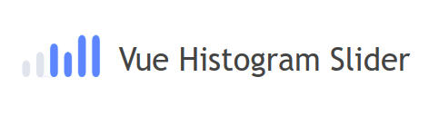
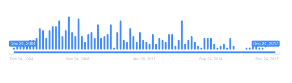

<p align="center">
    
</p>
<p align="center">
 Range slider with histogram for <a href="http://vuejs.org/" rel="nofollow" class="rich-diff-level-one">Vue</a>
</p>
<hr>

## Quick Start
If you are a try and learn developer, you can start trying the vue-histogram-slider now using codesandbox.io.

<a href="https://codesandbox.io/s/vue-histogram-slider-b7m0e?fontsize=14" target="_blank">
  
</a>


<p align="center">
    
</p>

## Installation    
### yarn
`yarn add vue-histogram-slider`

### npm
`npm i vue-histogram-slider`

## Usage
```js
import Vue from 'vue';
import HistogramSlider from 'vue-histogram-slider';

Vue.component(HistogramSlider.name, HistogramSlider);
```

```xml
<HistogramSlider
    :width="600"
    :bar-height="100"
    :data="[]"
/>
```

## Props

Property|Type|Default|Description
---|---|---|---
min|number|1|Set slider minimum value
max|number|100|Set slider maximum value
data|array| - |Data for histogram
block|boolean|false|Locks slider and makes it inactive
grid|boolean|true|Enables grid of values.
grid-num|number|4|Number of grid units.
step|number|1|Set sliders step. Always > 0. Could be fractional.
hide-min-max|boolean|true|Hides min and max labels
hide-from-to|boolean|false|Hides from and to labels
to-fixed|boolean|false|Fix position of right handle.
from-fixed|boolean|false|Fix position of left (or single) handle.
force-edges|boolean|false|Slider will be always inside it's container.
drag-interval|boolean|false|Allow user to drag whole range. Only in double type
keyboard|boolean|true|Activates keyboard controls. Move left: ←, ↓, A, S. Move right: →, ↑, W, D.
type|string|double|Choose slider type, could be single - for one handle, or double for two handles
width|number|600|width of dialog
bar-height|number|100|Set max histogram bar height
bar-width|number|6|Set histogram bar width
bar-gap|number|5|Set histogram bar gap
bar-radius|number|4|Set histogram bar radius
prettify|function|null|Set up your own prettify function. Can be anything. For example, you can set up unix time as slider values and than transform them to cool looking dates.
line-height|number|6|Set slider line height
transition-duration|number|100|Set duration to histogram bars
primary-color|string|#0091ff|Primary color
holder-color|string|#dee4ec|Holder color
handle-color|string|#ffffff|Slider handle color
grid-text-color|string|silver|Primary color
font-family|string|'Arial, sans-serif'|Set text font family
font-size|number|12|Set text font size
hist-slider-gap|number|6|Set gap between slider and histogram
update-color-on-change|boolean|true|Update histogram bar color on change **(recommended false for performance)**

## Event
Name|Description
---|---
start |Triggers when slider start.
change|Triggers when each values change.
update|Triggers when slider is modified by external methods update or reset.
finish|Triggers when user releases handle.

